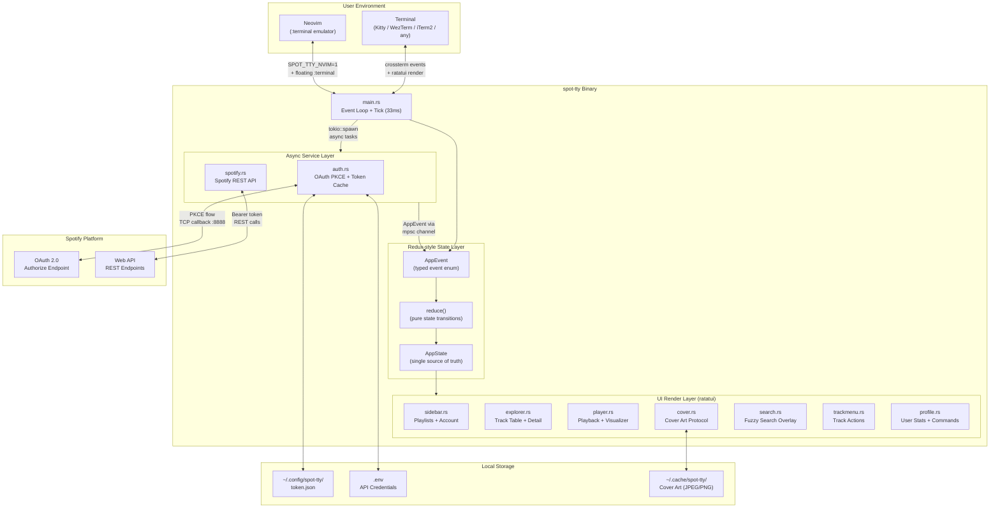
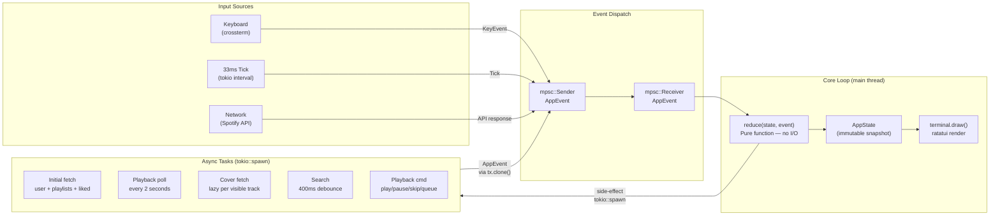
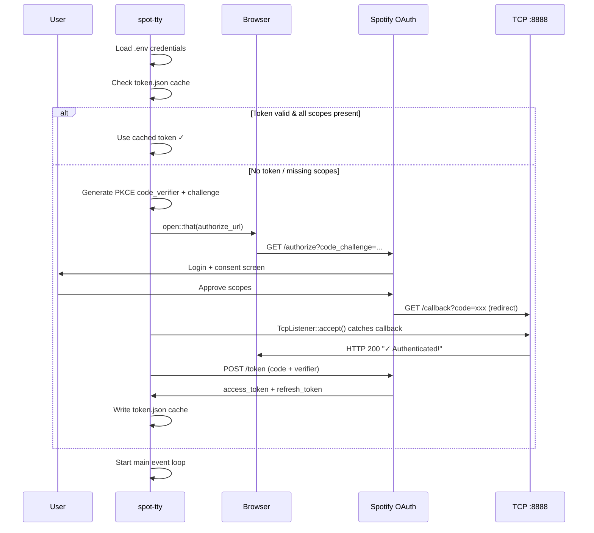
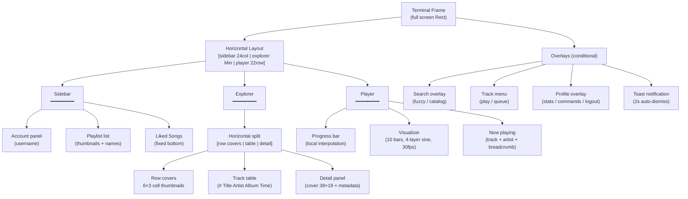
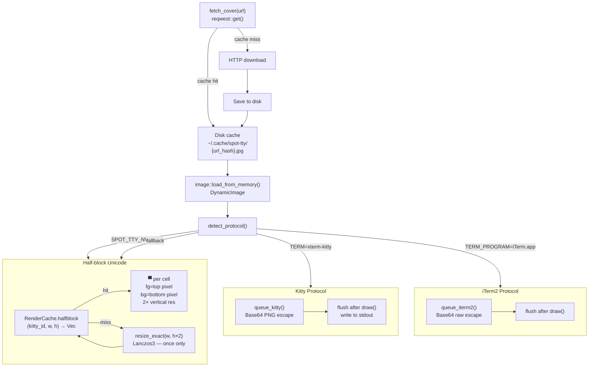
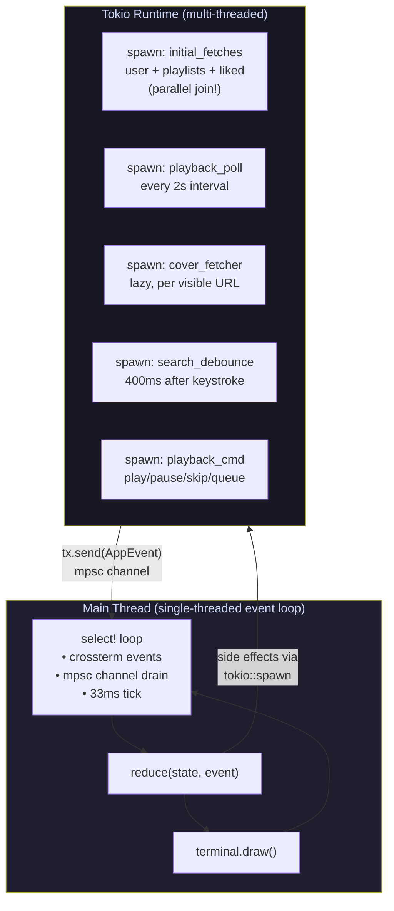
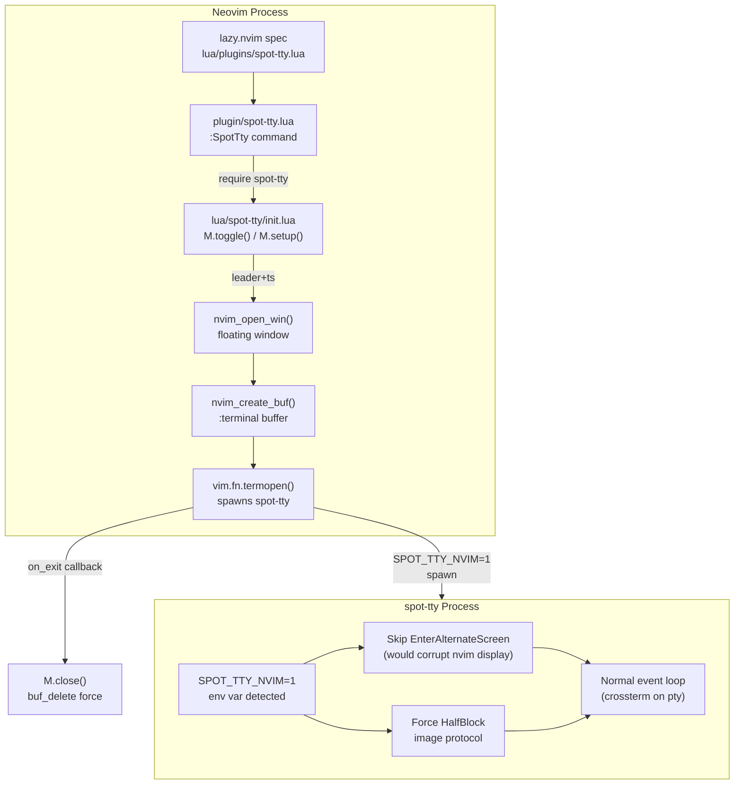
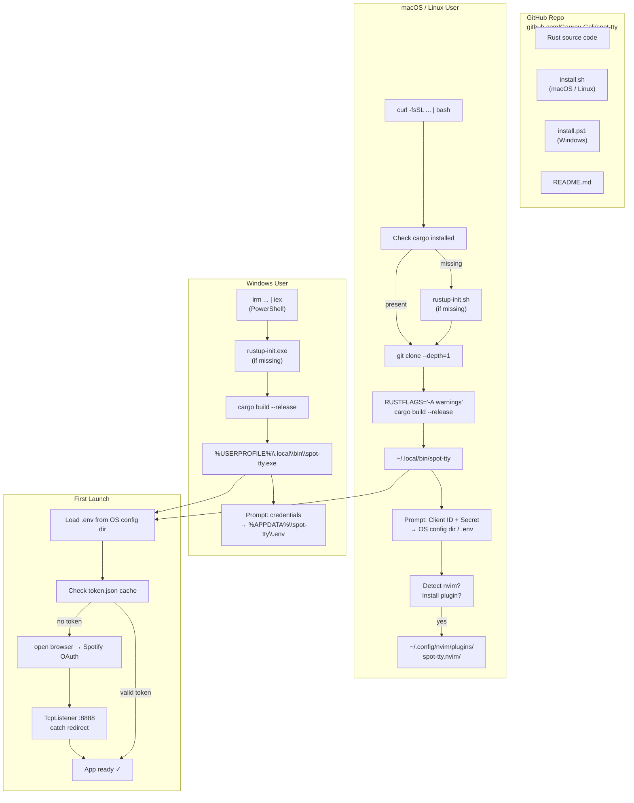
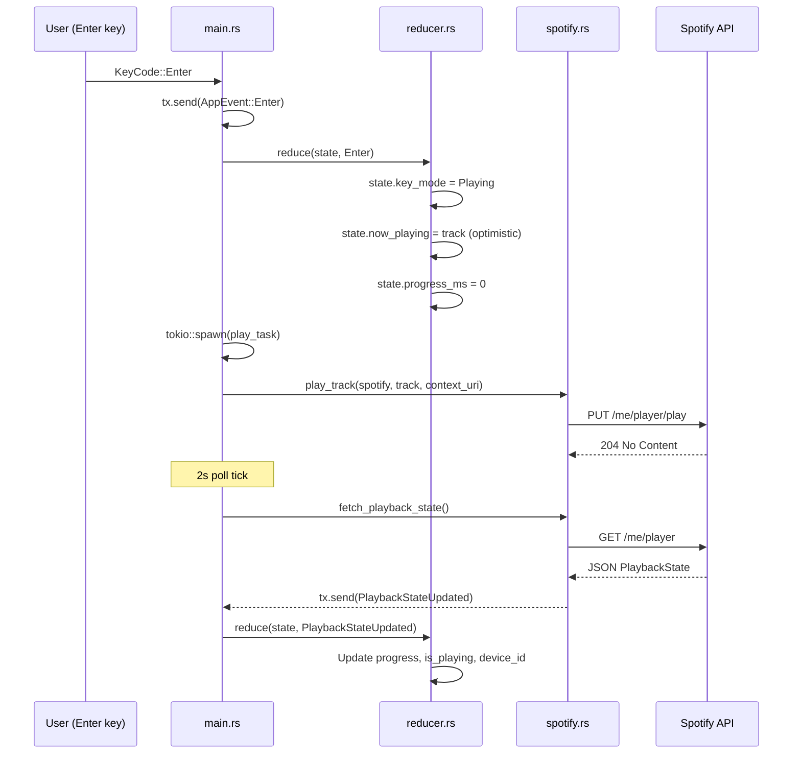
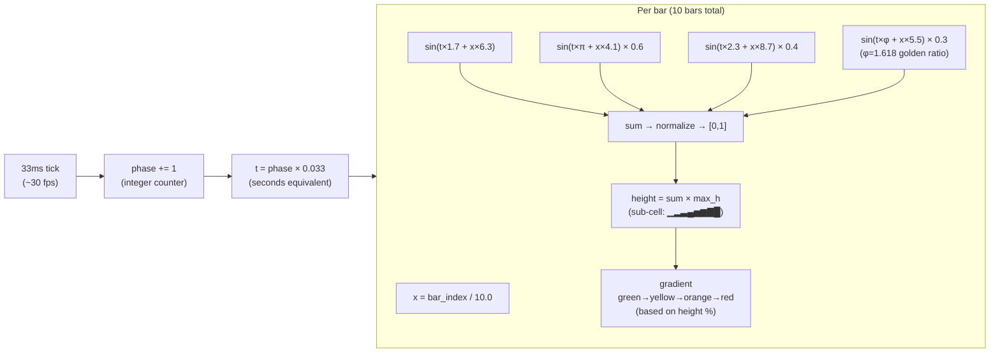

# spot-tty — Architecture & Engineering Deep Dive

---

## 1. High-Level System Architecture

---

## 2. Event-Driven State Machine (Redux Architecture)

---

## 3. OAuth PKCE Authentication Flow

---

## 4. UI Component Tree & Render Pipeline

---

## 5. Cover Art Rendering Pipeline

---

## 6. Async Concurrency Model

---

## 7. Neovim Plugin Architecture

---

## 8. Install & Distribution Pipeline

---

## 9. Data Flow — Track Playback

---

## 10. Visualizer — Signal Processing

---

## DevOps & Engineering Concepts Used

| Concept | Implementation |
|---|---|
| **Unidirectional data flow** | Redux pattern: AppEvent → reduce() → AppState → render() |
| **Actor model (lite)** | tokio::spawn tasks communicate only via mpsc channels |
| **Optimistic UI updates** | State updated immediately on user action; API confirms async |
| **Protocol detection** | Runtime capability sniffing (Kitty / iTerm2 / half-block fallback) |
| **Lazy loading** | Covers fetched only for visible items per frame |
| **Disk cache** | SHA-256 URL → filename, covers persisted across sessions |
| **In-memory render cache** | Half-block pixel buffers keyed by (image_id, w, h) — resize once |
| **OAuth 2.0 PKCE** | Proof Key for Code Exchange — no client secret in auth flow |
| **Local HTTP server** | TcpListener on :8888 catches OAuth redirect without a web server |
| **Token validation** | Scope diff on load — re-auth if scopes expanded since last login |
| **Scroll debounce** | 120ms settle timer before fetching cover for selected track |
| **Search debounce** | 400ms after last keystroke before hitting Spotify catalog API |
| **Parallel init fetches** | tokio::join! for user + playlists + liked tracks simultaneously |
| **Platform abstraction** | dirs::config_dir() → correct path on macOS / Linux / Windows |
| **Environment detection** | SPOT_TTY_NVIM=1 → skip alt-screen, force half-block, adjust layout |
| **CI-free distribution** | Source distribution via install.sh / install.ps1 — users build locally |
| **Frame deduplication** | RenderCache skips re-sending Kitty escape sequences if unchanged |
| **Vim-style navigation** | Modal key handling (Normal / Search / Menu / Profile modes) |
